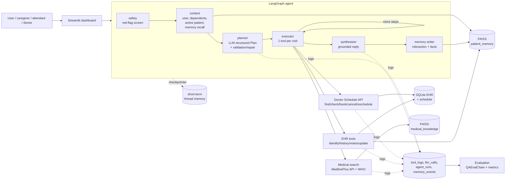

# 🩺 Agentic Healthcare Assistant for Medical Task Automation

*Applied Generative AI Specialisation: Capstone Project*

This is a virtual medical assistant that handles four tasks end to end: **booking appointments**, **managing medical
records**, **summarising medical histories** and **searching trusted medical sources** (MedlinePlus, WHO). Under
the hood it is a **LangGraph** agent with a planner and a tool executor. It has **FAISS**-backed long-term memory,
a **RAG** pipeline with citations, and guard-rails for emergencies, privacy and roles. An **LLMOps** layer and a
multi-page **Streamlit** dashboard sit on top: QAEvalChain plus offline metrics, and per-tool success and latency logging.

> **Reference scenario** (from the problem statement), handled end to end:
> *"My 70-year-old father has chronic kidney disease. I want to book a nephrologist for him. Also, can you
> summarize latest treatment methods?"*
> The agent does four things in order:
> 1. Identifies the father through the caregiver link.
> 2. Retrieves and summarises his CKD history, with lab alerts.
> 3. Books the earliest nephrology slot.
> 4. Returns a cited MedlinePlus/WHO summary of CKD treatment.

---

## Quick start

```bash
pip install -r requirements.txt
cp .env.example .env              # optional: add GROQ_API_KEY / OPENAI_API_KEY / ANTHROPIC_API_KEY
python -m healthcare_agent.build  # dataset -> SQLite EHR + FAISS indexes (auto-runs on first app launch)
streamlit run app.py              # dashboard at http://localhost:8501
```

| Command | Purpose |
|---|---|
| `python -m healthcare_agent.evaluation.runner` | run the full evaluation suite; writes `reports/latest_evaluation.md` |
| `python -m pytest -q` | 27 tests on an isolated database with no network and no LLM |
| `python scripts/build_knowledge_seed.py` | refresh the offline MedlinePlus/WHO corpus (`data/knowledge_seed.json`) |
| `python scripts/make_notebook.py` | regenerate the walkthrough notebook |
| `notebooks/Agentic_Healthcare_Assistant.ipynb` | executed walkthrough of Part 1 and Part 2 |
| `docs/Capstone_Writeup.pdf` | 15-page project writeup (`python scripts/build_writeup.py` rebuilds it from the evaluation reports) |

**LLM providers.** The provider is picked automatically from whichever key is set, in this order: Groq
(`llama-3.3-70b-versatile`), OpenAI (`gpt-4o-mini`), Anthropic (`claude-haiku-4-5`), OpenRouter. Ollama works via
`LLM_PROVIDER=ollama`. **With no key** the system runs in a deterministic *offline mode*: a rule-based planner,
template/extractive summaries, and the same tools, memory, RAG retrieval and UI. That keeps demos and tests
reproducible. Every LLM call has a logged fallback, so a provider outage never breaks a user flow.

---

## Architecture



| Layer | Implementation |
|---|---|
| **Planner** | Structured-output LLM call producing a typed `Plan` (sub-goals, tool, args, `depends_on`). Tool catalogue, date, acting user, dependents, active patient and recalled memories are injected into the prompt. `validate_plan` repairs any plan: it removes unknown or duplicate tools, strips staff-only steps for patients, inserts a missing `identify_patient` step and wires dependencies. |
| **Executor** | Runs one tool per graph step. It injects the resolved `patient_id` and patient context (for personalised RAG), and skips steps whose dependencies failed. |
| **Tools** (13) | **Schedule API:** `find_doctors`, `check_availability`, `book_appointment` (atomic conditional UPDATE, idempotent), `cancel_appointment`, `reschedule_appointment` (book-then-release), `list_appointments`. **EHR:** `identify_patient`, `get_patient_history`, `search_patient_notes`, `register_patient`\*, `update_patient_record`\*, `add_clinical_note`\* (LLM extraction of structure from free text). **Search:** `medical_info_search`. \*staff only |
| **Memory** | Short-term memory: the LangGraph checkpointer, per chat thread (messages plus active patient). Long-term memory: SQLite `memories` plus the FAISS `patient_memory` index (profiles, encounter chunks, learned facts), recalled before planning. |
| **RAG** | MedlinePlus Web Service (XML) and WHO (site-restricted search with fact-sheet extraction). Documents are cached in SQLite, chunked, embedded with `bge-small-en-v1.5` and stored in FAISS. The top-k passages go into a numbered-source prompt that returns a cited answer. |
| **Guard-rails** | An emergency red-flag screen runs before planning. Privacy: caregivers see only themselves and linked dependents. Roles: only attendants and doctors edit records. Clinical alerts are rule-based, never generated by the LLM. |
| **LLMOps** | Every tool, LLM and memory operation is logged. Evaluation covers planner accuracy, summary and QA quality (QAEvalChain, similarity, ROUGE-L, key-fact coverage, groundedness), retrieval hit@k/MRR, and booking reliability. |

### Data

| Source | Handling |
|---|---|
| `records.xlsx` | One row per encounter. De-duplicated to 5 patients; the `Summary` column becomes the reference for summary evaluation. |
| `sample_report_*.pdf` | *History & Physical* layout. Parsed into demographics, SOAP sections, ICD-10 diagnoses, medications and vitals. |
| `sample_patient.pdf` | 12-page EHR export. Pages are grouped by encounter footer; the parser extracts progress notes, the PMH page and CCD documents, giving **45 labs with reference ranges and H/L flags**, meds and vitals. |
| *Synthetic* (`seed.py`) | Not in the dataset but needed by the use case: 15 doctors across 13 specialties with working hours, a rolling 21-day slot calendar with ~30% of slots held by other channels, and **Suresh Negi** (70, CKD 3b, father of Rahul Negi) for the reference scenario. All of it is tagged `source=synthetic_demo`. |

---

## Mapping to the problem statement

| Requirement | Where |
|---|---|
| Planner interprets multi-step queries and decomposes them into sub-goals | `agent/planner.py`, `prompts.PLANNER_SYSTEM`; plan shown in chat and in Memory & logs |
| Identify tools/APIs per sub-goal | `tools/__init__.py` registry → `Plan.steps[].tool` |
| Appointment booking API | `tools/scheduling.py` |
| Medical history management (EHR DB) | `db.py`, `records.py`, `tools/patient.py`, Patient view → *Manage record* |
| Disease search (web search / Medline) | `tools/medical_search.py` |
| FAISS vector DB for patient summaries | `vectorstore.py`, `memory.py` (`patient_memory`) |
| Long-term patient context memory | `memory.py` + `context` node + `memory` node |
| Structured prompts per sub-task; prompt chains; memory in prompts | `prompts.py` (planner → history summary / medical RAG → synthesis → memory extraction) |
| Sample-scenario agent workflow | `tests/test_agent.py::test_capstone_reference_scenario`, notebook §5, chat example button |
| QAEvalChain / accuracy and relevance | `evaluation/metrics.py::qa_eval_chain_grades`, `evaluation/runner.py` |
| Per-module performance (booking success, precision) | `evaluation/runner.py`, Evaluation page |
| Patient and doctor views | `app_pages/patient_view.py`, `app_pages/doctor_view.py` |
| Real-time appointment tracking | `app_pages/appointments.py` (auto-refresh fragment) |
| Latest retrieved medical information | `app_pages/medical_info.py` |
| Evaluation metrics for responses and tools | `app_pages/evaluation.py` |
| Memory traces and planning breakdowns | `app_pages/memory_logs.py` |
| Interactive scenario testing | `app_pages/scenarios.py` |
| Tool usage and success/failure logs | `observability.py` → `tool_logs`, Memory & logs → *Tool & LLM logs* |

---

## Project structure

```
app.py                      Streamlit entry (st.navigation)
app_pages/                  8 dashboard pages
ui/common.py                shared UI helpers, chart style, acting-user selector
healthcare_agent/
  config.py  llm.py         settings; provider-agnostic LLM with logged fallbacks
  db.py  records.py         SQLite schema; EHR repository, alerts
  ingest.py  build.py       PDF/XLSX parsers; build pipeline
  seed.py  domain.py        synthetic doctors/slots/demo family; specialty routing, date parsing
  vectorstore.py memory.py  FAISS store; long-term memory
  prompts.py  context.py  observability.py
  tools/                    scheduling, patient/EHR, medical_search (+ registry)
  agent/                    graph (LangGraph), planner, responder, safety
  evaluation/               cases (golden sets), metrics, runner
data/raw/                   provided dataset (copied)
data/knowledge_seed.json    cached MedlinePlus/WHO corpus (43 docs)
notebooks/                  executed walkthrough
tests/                      pytest suite
docs/PROJECT_REPORT.md      design decisions, results, limitations
```

## Demo script (5 minutes)

1. **Chat**, signed in as *Rahul Negi*: click the reference-scenario example. Open **Plan** and **Execution trace**.
2. Follow up with *"Also book a dietitian for him next week in the morning"*. The patient is resolved from conversation memory.
3. **Appointment tracker**: both bookings appear live.
4. **Patient view** → *Suresh Negi*: alerts and the eGFR trend. Switch the user to *Front-desk Attendant* and add a note under *Manage record*.
5. **Scenario tester**: run all scenarios, including the emergency, privacy and role guard-rails.
6. **Evaluation**: run the suite. **Memory & logs**: inspect a run's planning breakdown and memory operations.

*This is an educational prototype on sample and synthetic data. It is not a medical device and does not give medical advice.*
